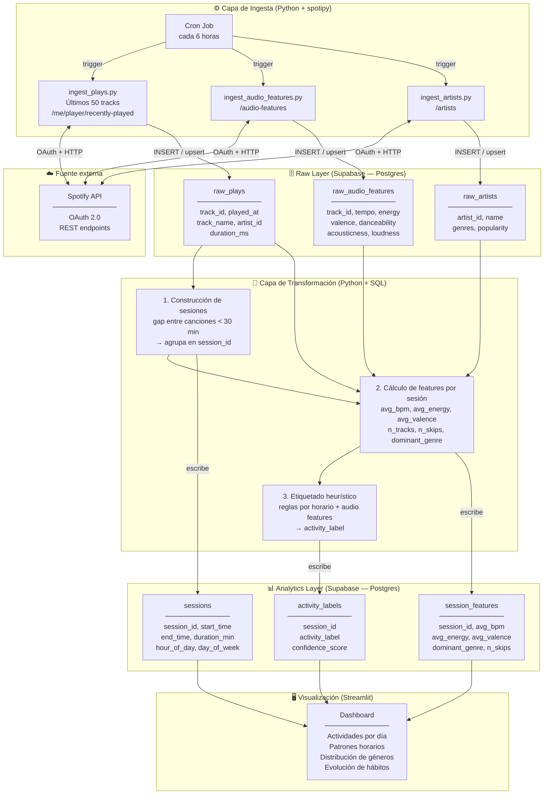

# Arquitectura — Spotify Activity Detector (Camino A: Batch Pipeline)

## Diagrama general



---

## Explicación por capa

### Fuente externa — Spotify API
La API de Spotify usa **OAuth 2.0**. El usuario autoriza la app una vez y la librería `spotipy`
maneja el token de acceso y su renovación automática.

Limitación clave: el endpoint `/me/player/recently-played` solo retorna los **últimos 50 tracks**.
Por eso la ingesta debe correr frecuentemente (cada 6 horas como máximo) para no perder historial.

---

### Capa de Ingesta
Tres scripts independientes, cada uno con una responsabilidad única:

| Script | Endpoint Spotify | Qué guarda |
|---|---|---|
| `ingest_plays.py` | `/me/player/recently-played` | Qué canción, cuándo, por cuánto tiempo |
| `ingest_audio_features.py` | `/audio-features/{ids}` | BPM, energía, valencia, etc. |
| `ingest_artists.py` | `/artists/{ids}` | Géneros, popularidad del artista |

Todos hacen **upsert** (insert si no existe, ignorar si ya está) para evitar duplicados.
Un `cron job` local los dispara cada 6 horas.

---

### Raw Layer — Supabase (Postgres)
Guardamos los datos **tal como vienen de la API**, sin transformar.

Por qué es importante tener una capa raw:
- Si la lógica de transformación cambia, podemos reprocesar desde los datos originales
- Es el patrón estándar en Data Engineering (medallion architecture: Bronze → Silver → Gold)
- Facilita el debugging: siempre puedes ver qué recibiste exactamente de Spotify

---

### Capa de Transformación
Aquí vive la lógica de negocio real. Tres pasos secuenciales:

**Paso 1 — Construcción de sesiones**
Ordena los plays por `played_at` y agrupa los que tienen menos de 30 minutos de gap entre sí.
Cada grupo es una sesión con su `session_id`, `start_time` y `end_time`.

**Paso 2 — Cálculo de features por sesión**
Agrega los audio features de todas las canciones de la sesión:
promedio de BPM, energía, valencia, género dominante, cantidad de skips.

**Paso 3 — Etiquetado heurístico**
Aplica reglas explícitas para asignar una actividad:

```
SI  duration < 15 min
AND avg_energy > 0.7
AND hora IN (6-9am, 9-11pm)
→ activity_label = "ducha"

SI  duration BETWEEN 45 AND 90 min
AND avg_bpm BETWEEN 120 AND 180
AND day_of_week IN (lunes, miércoles, viernes)
→ activity_label = "gimnasio"

...etc.
```

---

### Analytics Layer — Supabase (Postgres)
Tres tablas limpias, ya procesadas, listas para consultar:

- `sessions` — una fila por sesión de escucha
- `session_features` — los indicadores calculados de esa sesión
- `activity_labels` — la etiqueta inferida con un puntaje de confianza

Esta separación sigue el principio de **Single Responsibility**: cada tabla responde una pregunta diferente.

---

### Visualización — Streamlit
Dashboard conectado directamente a Supabase via `psycopg2` o el cliente de Supabase para Python.

Vistas planeadas:
- ¿Cuántas sesiones de gym tuve esta semana?
- ¿A qué horas escucho música de trabajo vs. descanso?
- ¿Cómo cambió mi energía musical promedio en el último mes?

---

## Flujo de datos resumido

```
Spotify API
    ↓  (cada 6h, via cron)
Scripts de ingesta (Python + spotipy)
    ↓  (upsert)
Raw Layer — 3 tablas en Supabase
    ↓  (script de transformación)
Construcción de sesiones → Features → Etiquetas
    ↓  (escribe resultados)
Analytics Layer — 3 tablas en Supabase
    ↓  (query directa)
Streamlit Dashboard
```

---

## Decisiones de arquitectura y por qué importan

| Decisión | Alternativa descartada | Razón |
|---|---|---|
| Supabase (Postgres) desde día 1 | SQLite local | Pipeline cloud-native, sin migración futura, mejor para portfolio |
| Upsert en lugar de insert | Insert simple | Evita duplicados si el cron corre más de una vez en la misma ventana |
| Separar raw de analytics | Una sola tabla | Permite reprocesar si la lógica cambia; patrón estándar en DE |
| Etiquetado heurístico en fase 1 | ML desde el inicio | Las reglas son auditables y explicables; ML se agrega en fase 2 con datos reales |
| Streamlit para visualización | Power BI / Metabase | Se deploya con una sola línea, soporta Python nativo, ideal para portfolio |
